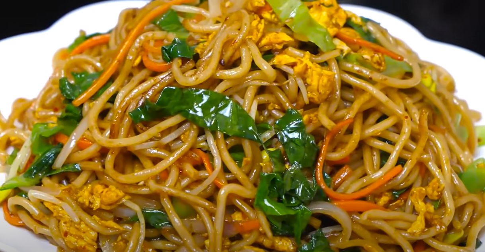

# 主食

## 炒饭

### 酱油炒饭

**原料**

隔夜米饭加入少许食用盐保鲜

少许萝卜干/榨菜

鸡蛋2个

葱花

**制作**

1. 米饭放入淀粉并加入少许老抽然后拿保鲜袋抓散

2. 萝卜干切成细丁

3. 鸡蛋蛋黄蛋清分离

4. 蛋清下油锅炒散

5. 蛋黄下油锅小火炒散并加入萝卜丁

6. 加入蛋白炒匀

7. 加入米饭

8. 锅边倒入生抽，少许油，炒匀

9. 加入葱花翻炒一分钟出锅

## 炒面

### 鸡蛋炒面

**原料**

3个鸡蛋

湿面一包（超市卖的那种）

半个洋葱

一颗生菜

半根胡萝卜

一把黄豆芽

**制作**

1. 水烧开下入面条

2. 煮至8成熟，捞出过凉，控干水分，加入少许油防止粘连，备用

3. 锅中倒油，放入鸡蛋炒散，盛出备用

4. 锅中倒油，放入豆芽炒至断生，放入胡萝卜洋葱，加入少许胡椒粉，炒出香味

5. 下入面条，翻炒几下，加入少许盐，鸡精，耗油，生抽，少许老抽

6. 翻炒均匀，加入鸡蛋，翻炒均匀，出锅前加入生菜丝