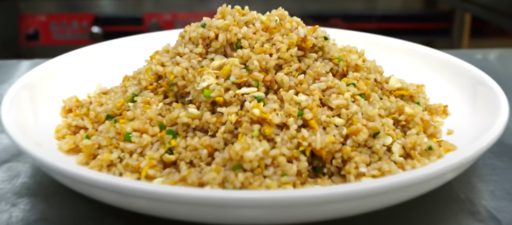

# 主食

## 炒饭

### 酱油炒饭

**原料**

隔夜米饭加入少许食用盐保鲜

少许萝卜干/榨菜

鸡蛋2个

葱花

**制作**

1. 米饭放入淀粉并加入少许老抽然后拿保鲜袋抓散

2. 萝卜干切成细丁

3. 鸡蛋蛋黄蛋清分离

4. 蛋清下油锅炒散

5. 蛋黄下油锅小火炒散并加入萝卜丁

6. 加入蛋白炒匀

7. 加入米饭

8. 锅边倒入生抽，少许油，炒匀

9. 加入葱花翻炒一分钟出锅