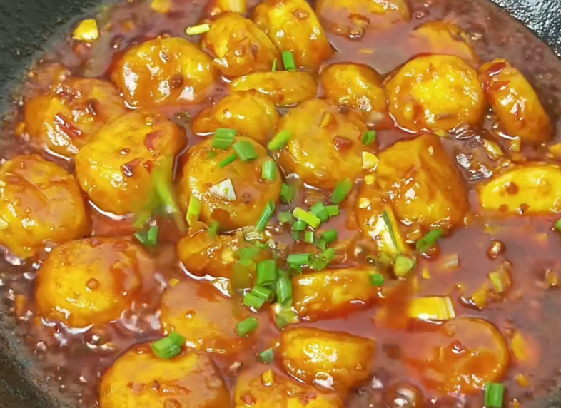

# 家常菜

## 凉菜

## 热菜

### 日本豆腐

**酱汁：**

> tips:使用普通陶瓷勺子

- 半勺白糖
- 一勺生抽
- 两勺香醋
- 一勺耗油
- 一勺豆瓣酱

加入大半碗清水稀释，备用

**底料**

- 半个蒜头

拍碎给他搞成蒜末

**原料**

- 日本豆腐七根

切成圆形，放入保鲜袋或者碗中，加入2勺淀粉，摇匀(轻，易碎)

**制作**

油锅里倒，加入蒜末，爆香，加入日本豆腐，导入酱汁。盖上锅盖中小火收汁，最后撒上葱花。