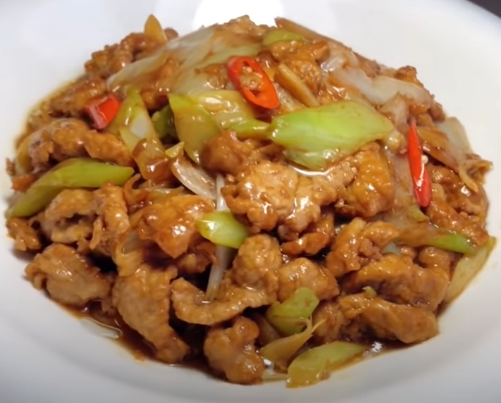

# 家常菜

## 凉菜

## 热菜

### 葱爆肉

**酱汁：**

- 半勺白糖
- 一勺生抽
- 一点点陈醋
- 多点料酒
- 少许胡椒粉
- 少许香油

**原料**

猪里脊肉一块

大葱一根

红椒一个

少许生姜

**制作**

1. 猪肉切片放入清水去血水

2. 腌制，放入少许盐、胡椒粉、老抽、料酒，抓匀

3. 加水继续抓匀，加鸡蛋清抓匀，最后加入淀粉锁住水分抓匀，加入少许色拉油，防止粘锅

4. 葱，红椒，生姜切碎

5. 起锅低油温，下肉片，7成熟出锅备用

6. 加入底料炒香，加入肉片，锅边导入少许酱油，翻炒1分钟出锅

### 日本豆腐

**酱汁：**

> tips:使用普通陶瓷勺子

- 半勺白糖
- 一勺生抽
- 两勺香醋
- 一勺耗油
- 一勺豆瓣酱

加入大半碗清水稀释，备用

**底料**

- 半个蒜头

拍碎给他搞成蒜末

**原料**

- 日本豆腐七根

切成圆形，放入保鲜袋或者碗中，加入2勺淀粉，摇匀(轻，易碎)

!> 尽量做一个煎一个，然后煎完放边上备用，否则等做完一起煎淀粉都沾到一起了

**制作**

油锅里倒，加入蒜末，爆香，加入日本豆腐，导入酱汁。盖上锅盖中小火收汁，最后撒上葱花。